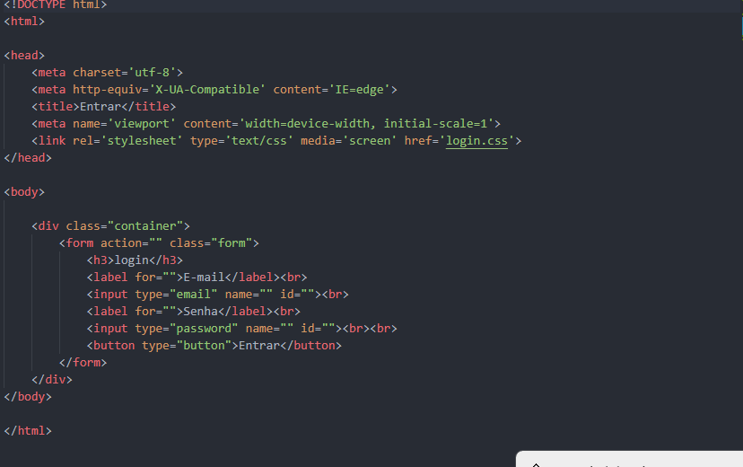
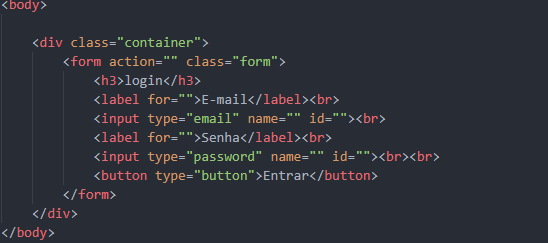
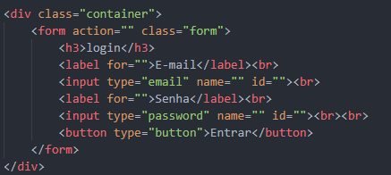
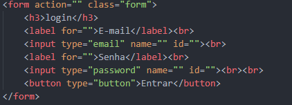

# projeto-login
Projeto criado como parte avaliativa da disciplina de Fundamentos de desenvolvimento ministrada pelo professor Leonardo Rocha.
 
## Ìndice
 
* [Descrição](#descrição)
* [Tecnologias](#tecnologia)
* [Referencia](#referência)
* [Autor(a)](#autora)
 
### Descrição
O projeto consiste em criarmos uma tela de login simples utilizando html e css3.
 
### Resultado do projeto
 
#### Tela login
 
* Estrutura Html-<html> (Linguagem de Marcação de HiperTexto) é o bloco de construção mais básico da web. Define o significado e a estrutura do conteúdo da web.
 
Veja a imagem a seguir:
 

 
 
 
* Head - O elemento <head> representa uma coleção de metadados para o documento. Metadados são, como o próprio nome diz, dados sobre os dados.
 
Veja a imagem a seguir:
 

 
 
* Body - <body> contém o corpo de um documento HTML, que é exibido pelo navegador em sua janela, ou seja, todo o conteúdo visível do site.
 
Veja a imagem a seguir:
 

 
 
* Div - <div> *é um container genérico para conteúdo de fluxo, que de certa forma não representa nada. Ele pode ser utilizado para agrupar elementos para fins de estilos.
 

 
 
* Form - <form>  indica que estamos iniciando um formulário, recebe como principais atributos method que recebe como valor o método http que esse formulário irá executar (get, post) e action que especifica para onde enviar os dados do formulário quando um formulário é enviado.
 

 
 
### Propriedades CSS
 
* `Display` - define se um elemento é tratado como um bloco ou elemento inline e o layout usado para seus filhos, como layout de fluxo, grid ou flex.
 
* `justify-conten` - define como o navegador distribui o espaço entre e ao redor dos itens de conteúdo ao longo do eixo principal de um contêiner flexível e do eixo embutido dos contêineres de grade e multicol.
 
* `align-items` - define o valor em todos os filhos diretos como um grupo. No flexbox, ele controla o alinhamento de itens no eixo cruzado . No layout de grade, ele controla o alinhamento de itens no eixo de bloco dentro de suas áreas de grade.
 
* `background-image` - define uma ou mais imagens de fundo em um elemento.
 
* `background-color` - define a cor de fundo de um elemento.
 
* `padding` -O preenchimento é usado para criar espaço ao redor do conteúdo de um elemento, dentro de quaisquer bordas definidas.
 
 * `padding-top`- A propriedade CSS define a altura da área de preenchimento na parte superior de um elemento.padding-top
 
* `border-radius`- arredonda os cantos da borda externa de um elemento. Você pode definir um único raio para fazer cantos circulares, ou dois raios para fazer cantos elípticos.
 
* `color` - O tipo de dado CSS <color> indica um cor no espaço sRGB . Uma cor pode ser descrita em qualquer uma destas formas:
 
* `box-shadow` -  é utilizado para adicionar efeitos de sombra em volta de um elemento. Você pode especificar mais de um efeito, os separando com virgulas.
 
 
 
#### RESULTADO
 
 

 
 
 
 
### estilização
  O projeto foi estilizado, utilizando css, foi criado um arquivo
  chamado login.css. Nesse arquivo, constam configurações de estilo
  apresentadas a seguir:
 
  * Estilo de cores- A cor de fundo do projeto foi definida como segue:
 
```
.form {
    background-image: linear-gradient(150deg, #3693a3 0, #93bef0 16.67%, #bfceee 33.33%, #3e667c 50%, #a9d2e2 66.67%, #96bddd 83.33%, #537a8a 100%);
    background-color: #3dcefa;
    padding: 30px;
    padding-top: 0;
    border-radius: 20px;
    color: rgb(68, 83, 116);
    box-shadow: 0 0 10px black;
}
 
```
 
 
## Tecnologia
* HTML5
* CSS3
* README
* GIT
* GITHUB
 
## Referência
https://www.alura.com.br/artigos/escrever-bom-readme
 
## Autor(a)
O projeto foi desenvolvido por:
Ana Laura Matos De Oliveira

